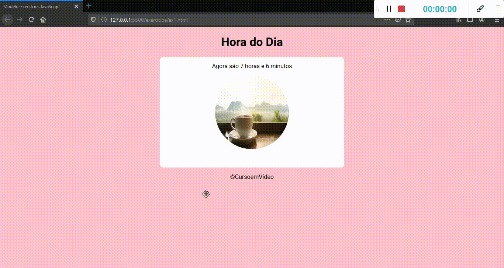

# Aplicação de HTML5, CSS3 e JAVASCRIPT 

## ESTRUTURAS CONDICIONAIS (If e Else)

>"O conhecimento evolui quando é compartilhado." - Patrick Espake

# Autores
* Marciana - *Idealizadora*

Acesse: https://marcianas1l.github.io/horadodia/

# Siga-me

* Instagram [marciana_sil](https://www.instagram.com/marciana_sil/)
* Twitter [marcianasiilva](https://twitter.com/marcianasiilva)
* LinkedIn [marciana-silva](https://www.linkedin.com/in/marciana-silva/)

